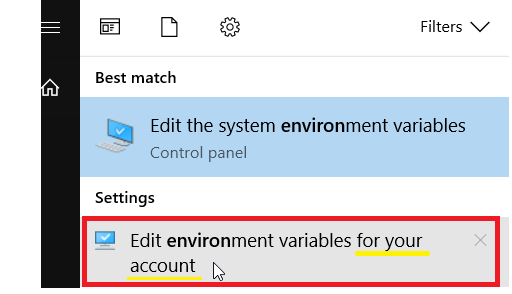
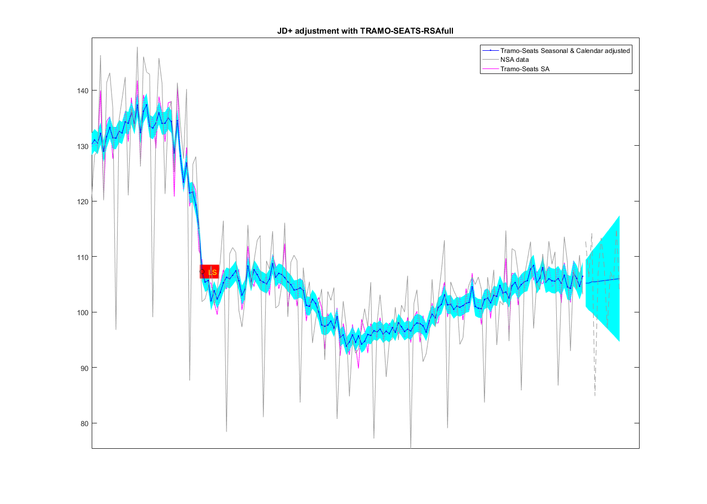

# mjdemetra

Matlab function to perform seasonal adjustment with JDemetra+ ([latest release](https://github.com/liedo/mjdemetra/releases/latest))

MJDemetra is a Matlab interface to JDemetra+, the seasonal adjustment
software [officially
recommended](https://ec.europa.eu/eurostat/cros/system/files/Jdemetra_%20release.pdf)
to the members of the European Statistical System (ESS) and the European
System of Central Banks. JDemetra+ implements the two leading seasonal
adjustment methods
[TRAMO/SEATS+](http://www.bde.es/bde/en/secciones/servicios/Profesionales/Programas_estadi/Programas_estad_d9fa7f3710fd821.html)
and [X-12ARIMA/X-13ARIMA-SEATS](https://www.census.gov/srd/www/x13as/).

Besides seasonal adjustment, JDemetra+ bundles other time series models
that are useful in the production or analysis of economic statistics,
including for instance outlier detection, [nowcasting](https://github.com/nbbrd/jdemetra-nowcasting/wiki), temporal
disaggregation or benchmarking.

For more details on the JDemetra+ software see
<https://github.com/jdemetra/jdemetra-app>.

MJDemetra offers access to some of the the seasonal adjustment options and outputs of JDemetra+. Feel free to modify it for your
own purposes. Note that Matlab reads Java code, so you can run any JDemetra+ algorithm without the need to modify the syntax.

## Installation

- Find the file ```demetra-tstoolkit-X.X.X.jar``` [here](https://github.com/jdemetra/jdemetra-core/releases) and copy it to your working directory or to a path that can be recognized by Matlab. This ```jar``` file contains the compiled packages with the core algorithms of JDemetra+.

- Make sure Matlab uses the appropiate Java version
(type ```version -java``` in Matlab to find out which version is used)
Matlab should use a Java SE version that is [compatible with
JDemetra+](https://github.com/jdemetra/jdemetra-app). You may not have the administrative rights to modify the system environment, but you can modify the local environment. For example, in Windows 10 you can search for the key word *environment* and select the second option: 


- Once you have accessed your local environment, select ```MATLAB_JAVA``` and define the location of the version of Java that is compatible with the version you want to use of JDemetra+ 


- Edit the ```classpath.txt``` file (type ```which classpath.txt``` in Matlab to find its location)
and make  sure the paths containing your .jar libraries are listed. For example, 
my ```classpath.txt``` file includes the path where the java compiled sofware of JDemetra+ is included:
```L:\...yourFolder....\demetra-tstoolkit-2.2.2.jar```.

- If you don't want to modify the ```classpath.txt``` file because you are using sofware that relies on older Java versions, then            add the line:
```javaclasspath('L:\...yourFolder...')``` 
at the beginning of the ```mjdemetra``` function so that the desired version of Java is used only within within the function.


## Use

To use the function you just need to input the 'data', which is a TsData object of JDemetra+. The remaining input arguments are not compulsory and they do not necessarily have to be introduced in order.

```Matlab
        [output, rslts]= mjdemetra(data,'horizon',20,'Method','TramoSeats','CalendarOption','RSAfull')
        [output, rslts]= mjdemetra(data2,            'Method','X13'      );
        [output, rslts]= mjdemetra(data,'horizon',20,'Method','TramoSeats','CalendarOption','RSA5')
        [output, rslts]= mjdemetra(data,'horizon',20,'Method','X13'       ,'CalendarOption','RSA5c')
        [output, rslts]= mjdemetra(data)
        [output, rslts]= mjdemetra(data,                                  ,'CalendarOption','RSA0')
        [output, rslts]= mjdemetra(data,                                                          , 'plot',false)
```

An overview of the possible options is available [here](https://jdemetradocumentation.github.io/JDemetra-documentation/pages/reference-manual/sa-specifications.html). 

The variables ```output``` and ```rslts``` contain all the information resulting from the seasonal adjustment. While ```rslts``` is a Java object of the class ```CompositeResults```, the ```output``` variable is a Matlab structure containing the seasonally adjusted data (sa) and the non-adjusted data (nsa)

The ```mjdemetra``` function can be used in many different ways.  By default, the method 'TramoSeats' is used (with specification ```RSAfull```), unless otherwise stated.  Also a  graph is plotted by default, displaying the following information:
-  raw data
-  adjusted data (seasonality and calendar effects have been eliminated)
-  adjusted data without removing calendar effects
-  uncertainty around the seasonally adjusted data (and forecasts): it is based on an approximation  of the uncertainty around  the linearized data and it excludes uncertainty stemming from parameter estimation.
-  outliers (LS stands for Level Shift, OA stands for Aditive Outlier)

## Example

The following code performs the following tasks:

- Load the data from excel and create the TsData object (note the Java code runs in Matlab without any problem)

```Matlab
[x,dates]=xlsread('gdpQ','data');
fechasExcel=dates(2:end,1)
y=x(:,1)
 

% define the dates
datesVector = datevec(fechasExcel);
firstYear= datesVector(1,1);
firstQuarter= 0; % 0 is the first Quarter (in Java you start counting from 0 and not from 1) 
% this is java code
firstPeriod = ec.tstoolkit.timeseries.simplets.TsPeriod(ec.tstoolkit.timeseries.simplets.TsFrequency.Quarterly, firstYear, 0);
data = ec.tstoolkit.timeseries.simplets.TsData(firstPeriod , y, false); 

```
- Perform the seasonal adjustment

```Matlab
[sa, rslts]= mjdemetra(data);  
```


### Figure: JDemetra+ seasonal adjustmentwith TramoSeats-RSAfull 


The data adjusted for seasonality and calendar effects is displayed in blue. The uncertainty around the seasonally adjusted data is displayed with a cyan shade around the blue line. Although in this example the uncertainty does not change much over time, one typically finds a slightly broader confidence bound at the end of the sample period. In this particular example, the increase in the uncertainty is only visible over the forecasting horizon. 

### Figure: Zoom 



If you zoom in, you can have a closer look at the differences between the *data adjusted for seasonality and calendar effects* (blue) and the *data adjusted for seasonality alone* (magenta dotted line)

